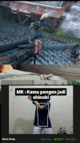

### Information

Inspired by [hoangv97/MotionMap](https://github.com/hoangv97/MotionMap)

This motion mapping powered by mediapipe holistic to decide pose. Currently the mapping is only fit for Sekiro game. If you need to use on another game you might need to adjust key_map on cv2_thread as an action pose.

## Getting Started

Execute this for the first time

### 1. Create virtual environment

`python -m venv venv`

### 2. Activate venv (Windows)

`venv\Scripts\activate`

### 3. Install library

`pip install mediapipe opencv-python pandas scikit-learn pydirectinput`

## Store your sample video

Before use the mapping, you need to provide sample videos to train the model that will decide the action. You can store the sample videos on root_dir/data/videos/<pose_name>/<videos.mp4>

Currently We had decide the name as below. You will need to adjust name below if you want to create new directory / pose

```
 MOVEMENT_ACTIONS = {
            "move_forward": 'w',
            "move_backward": 's',
            "move_left": 'a',
            "move_right": 'd'
        }

 key_map = {
            "deflect": 'k',
            "crouch": 'q',
            "attack": 'j',
            "deflect": 'k',
            "jump": 'space',
            "dash": 'shift',
            "grapple": 'f',
            "prosthetic": 'o',
            "use_item": 'r',
            "interact": 'e',
            "lock_on": 'v',
            "pause": 'esc'
        }

```

## Command to Update Motion Capture

### Step 1: Extract Video to CSV

`python extract_to_csv.py`

this will extract coordinate from your video (data/videos/<pose_name>) into `dataset.csv`

### Step 2: Training Model (Create file .pkl)

`python train_model.py`

this command will train the model with `dataset.csv`

### Step 3: Running the main app (Inference)

#### Make sure you have file app.py yang that call sekiro_classifier.pkl

`python app.py`


