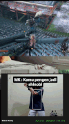

### Information

Inspired by [hoangv97/MotionMap](https://github.com/hoangv97/MotionMap)

This motion mapping powered by MediaPipe Holistic to decide pose. Currently the mapping is only fit for Sekiro game. If you need to use on another game you might need to adjust the mapping via the dashboard.

## Getting Started

### 1. Launch the Application

Run `run.bat` or execute `launcher.py` directly:

`python launcher.py`

The launcher will automatically:
- Request admin privileges (required for sending keystrokes to games)
- Create a virtual environment
- Install all dependencies (mediapipe, opencv-python, pandas, scikit-learn, pydirectinput, PyQt5, customtkinter)
- Open the **SHINOBI MOCAP SYSTEM** dashboard

## Dashboard Overview

The dashboard (`main_gui.py`) provides 4 main buttons:

| Button | Function |
|--------|----------|
| MANAGE POSES & MAPPING | Add/remove pose-to-key mappings |
| START MOCAP APP | Launch the camera + AI inference app |
| EXPORT VIDEO TO CSV | Extract landmark data from sample videos |
| TRAIN AI MODEL | Train the Random Forest classifier |



## Step-by-Step Workflow

### Step 1: Create Sample Videos

Record yourself performing each pose/action. Store the videos in:

```
data/videos/<pose_name>/<video.mp4>
```

For example:
```
data/videos/attack/attack_1.mp4
data/videos/attack/attack_2.mp4
data/videos/deflect/deflect_1.mp4
data/videos/run/run_1.mp4
```

> You can also create the folder structure automatically by adding a new pose via **Manage Poses & Mapping** in the dashboard.

### Step 2: Configure Mapping

Click **MANAGE POSES & MAPPING** on the dashboard to open the Pose Manager.

For each pose, configure:
- **Name**: the pose label (e.g. `attack`, `deflect`, `run`)
- **Key**: the keyboard key to press (e.g. `j`, `k`, `shift`)
- **Type**: `tap` (press once) or `hold` (press and hold)

The mapping is saved to `mapping.json`:

```json
{
    "poses": [
        { "name": "run",     "key": "shift", "type": "hold", "folder": "data/videos/run" },
        { "name": "attack",  "key": "j",     "type": "tap",  "folder": "data/videos/attack" },
        { "name": "deflect", "key": "k",     "type": "hold", "folder": "data/videos/deflect" }
    ]
}
```

### Step 3: Export Video to CSV

Click **EXPORT VIDEO TO CSV** on the dashboard, or run manually:

`python extract_to_csv.py`

This processes each video frame with MediaPipe Holistic and extracts 258 landmark features (pose + left hand + right hand) into `data/dataset.csv`.

### Step 4: Train the AI Model

Click **TRAIN AI MODEL** on the dashboard, or run manually:

`python train_model.py`

This trains a Random Forest classifier on `data/dataset.csv` and saves the model to `assets/models/sekiro_classifier.pkl`.

### Step 5: Run the Motion Capture App

Click **START MOCAP APP** on the dashboard, or run manually:

`python app.py`

The app will:
- Open your webcam
- Detect body/hand poses in real time using MediaPipe Holistic
- Predict the gesture using the trained model
- Simulate the mapped keyboard input when confidence > 80%
